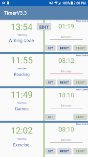
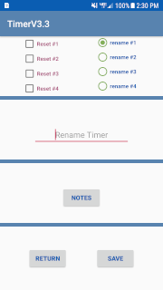
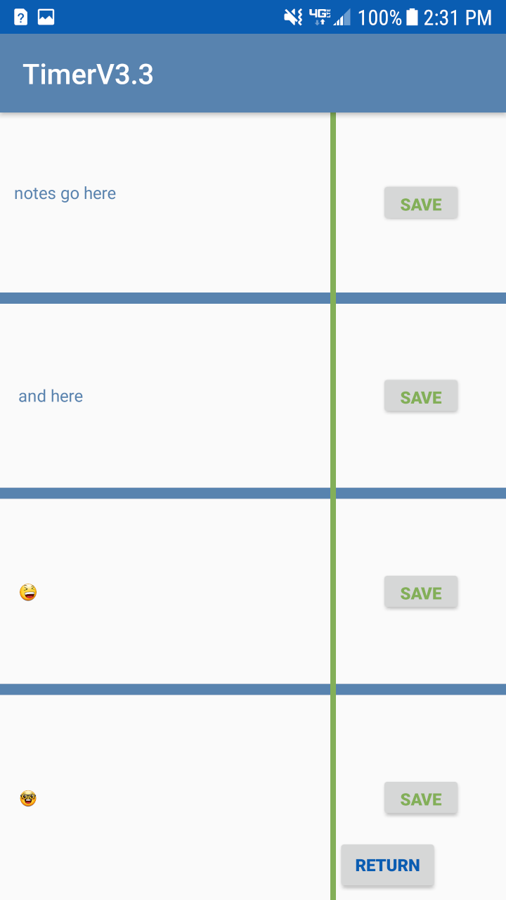

# Project_Timer

#### Android Timer App
> * The Project Timer App is a project timer to track all projects and hobbies
> * The timer has a control countdown that adds time to a time counter 
> * The timer has start,pause,resume functions on.
> * The timer has inputs to enter the name of your task.
> * It has inputs for notes tat track goals,and information about your task.
> * The timer has 4 timers to track multiple tasks at the same time.
---
#### Check out the Timer Images
Main activity 

---
Edit activity

---
Notes activity

---
#### Why I created this timer 
- I wanted to create a timer because I am always curious of how much time I spend on certin tasks.
- I created the timer to get more experiance with java and xml 
- To get experiance with Android Studio creating apps
---
#### Instructions for using this App 
- The Right side of the app is the timer control
- Enter the time in minutes and hit the set button , this sets the countdown time
- Hit the start button to begin the countdown, the countdown time is added to the total time
- The total Time is displayed on the left
- the reset button on the control only resets the countdown time that was entered earlier
- The Edit button pauses the timers and goes to the second activity where you can change the name,reset total times, and add notes
- In the Edit activity you have checkboxes to reset timers or rename timers
- The save button gets the name from the text input and rename radio button and sets the name on the main activity
- The return button just returns
- The note button goes to the notes activity
- The notes can be clicked on to be edited and a save button to save, only one note can be saved at a time
